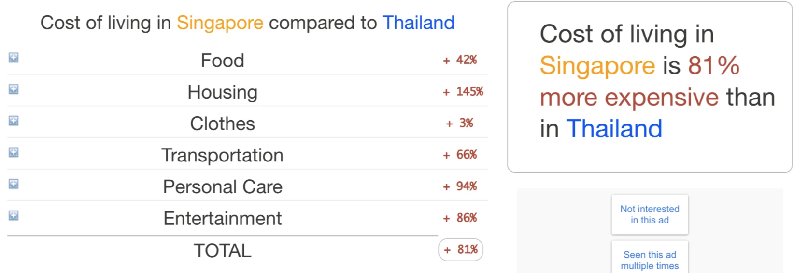
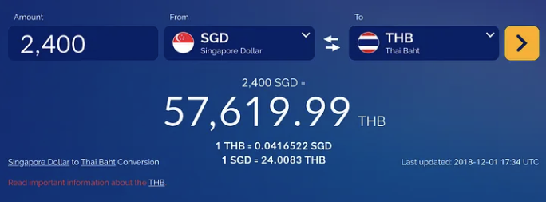
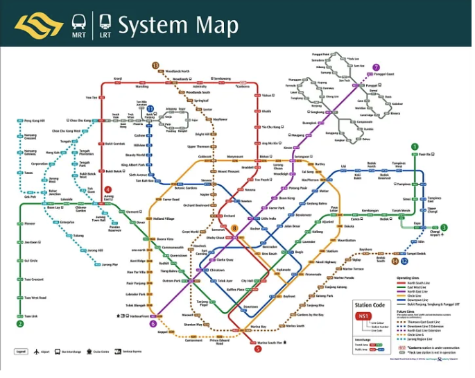
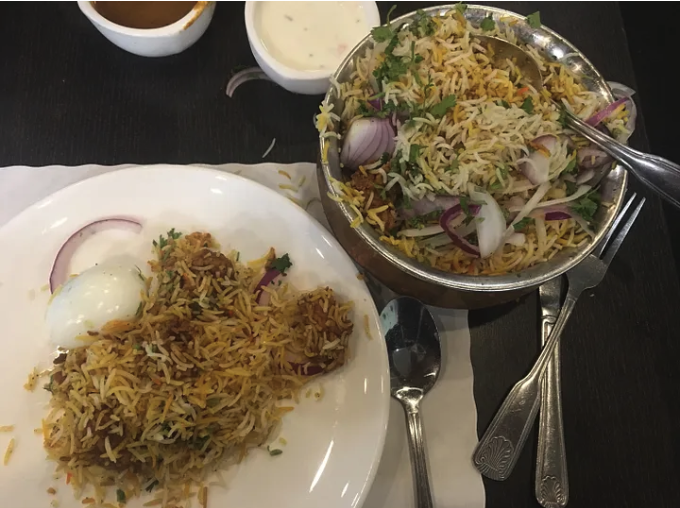
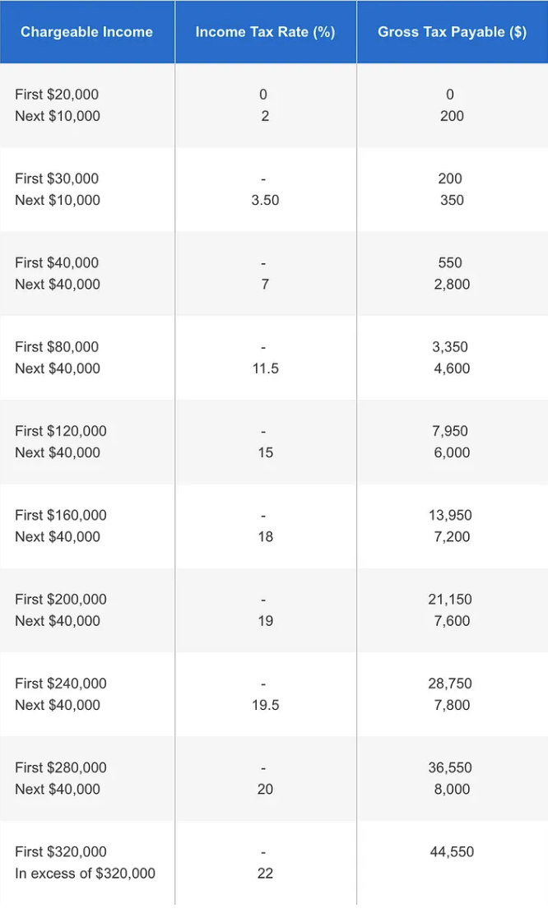

สวัสดีครับ ผมเป็น Expat มือใหม่ที่เพิ่งเริ่มชีวิตการทำงานในต่างประเทศมาได้ 6 เดือน นี่เป็นหกเดือนแรกที่มีแค่ครั้งเดียวเพราะเดือนต่อไปจะเป็น 7 เดือนแรก ผ่าง !!

ย้อนกลับไปหกเจ็ดเดือนที่แล้วที่ผมรู้ว่าได้ Offer จาก Facebook ที่ Singapore คำถามแรกที่ดังขึ้นมาในใจคือ เวรละทำไงดีวะ ดันได้ Offer มาโดยไม่คาดหมาย เพราะตั้งแต่แรก Recruiter และคนที่ refer มาบอกว่าส่วนใหญ่ครั้งแรกไม่ค่อยได้หรอก เป็นส่วนน้อยที่สัมภาษณ์ครั้งแรกแล้วได้เลย ครั้งนี้เลยไม่ค่อยได้วางแผนอะไรเพราะคิดว่าไม่น่าจะได้

Stage 0 — ได้ Offer มาในเวลาที่ไม่พร้อมสุดๆเป็นช่วงที่ยังสนุกสนานกับการทำงานที่ Agoda มากๆ รวมถึงได้ signal เรื่องการโปรโมทจากหัวหน้าหลายๆคน งาน community ในไทย และแผนทำ community ที่เชียงใหม่ก็เพิ่งเริ่ม ยังไม่ตกผลึกดีว่าจะทำอะไรบ้าง ภาระทางบ้านก็ยังเยอะ บ้านสองหลังที่ยังผ่อน ไหนจะแฟนที่กำลังกวนประสาทเพราะกลัวตกงาน ไหนจะเพื่อนที่ออฟฟิศที่สนิทกันทำงานเข้ามือกันดี ส่วนตัวเองตอนแรกคิดว่าจะไม่รับ Offer เพราะติดเพื่อนนี่แหละ เลยพยายามหาแนวร่วมที่จะบอกว่าไม่ไป ผมพยายามหาเพื่อนหลายๆคนที่ปรึกษากันได้ทั้ง level manager และ developer นี่แหละ ปรากฎว่ามีแค่คนเดียวที่บอกว่าไม่น่าไป แต่เหตุผลคือไม่รู้ว่าเป็นยังไง แต่ที่เหลือดันบอกว่าไปเหอะ โดยเฉพาะพี่โดม Dom Charoenyos นี่แหละ จำได้ว่าโทรหาแกแล้วแกบอกไปเลย คนที่สองก็ nuboat in wonderland คนนี้บอกเลยว่าพี่ไม่ต้องคิดไปก่อนค่อยคิด สุดท้ายเลยเตรียมใจจะตอบรับ Offer Facebook บอกให้ Recruiter ช่วยส่งรายละเอียดมาหน่อย

Stage 1 — ค่าครองชีพที่เปลี่ยน การย้ายประเทศจากไทยไปที่อื่นๆใน SEA อาจจะไม่ทำให้หลายๆคนกังวล แต่การย้ายจากไทยไปสิงคโปร์นี่หนักหนาสาหัสน่าดู ผมได้ลองปรึกษาเพื่อนรักชาวมาเซโดเนียของผม Alek นี่เป็นคนทำให้ผมกังวลที่สุดเลย เพราะเป็นคนแนะนำให้ไปดูเว็บ expertisan นี่ที่มีข้อมูล compare cost of living เวลาเราจะย้ายจากประเทศนึงไปประเทศนึง

เจอตัวเลขนี้เข้าไปผมถึงกับต้องร้องเพลงตะลึงขึ้นมาเลย แถมไอ้ปั๊บเพื่อนรัก (Apaichon Punopas) เคยมาบอกตัวเลขๆนึงเกี่ยวกับเงินเดือนที่นี่ แต่ offer ที่ผมได้มามันช่างต่างกันฟ้ากับเหว ผมนึ่เกิดหดหู่ขึ้นมาเลยว่านี่เราต่ำกว่า Standard ได้ขนาดนี้เลยเหรอ โดยไม่รอช้า ผมโทรหา Recruiter เพื่อพยายามต่อรองเงินเดือน และ Benefit ปรากฎว่าได้เพิ่มมานิดหน่อยแล้วก็ได้ข้อมูลจากต้นทางอีกที อ้าว ข่าวผิด !! แต่ไม่เป็นไรได้ option เพิ่มนิดหน่อย ขอบใจมากปั๊ปเพื่อนรัก ❤❤❤

Stage 2 (quantum state ที่ 0) — เปิดบัญชี การเปิดบัญชีที่ Singapore เป็นเรื่องง่ายมากสำหรับ Singaporian และ Permanent Resident แต่สำหรับ Expat ที่เข้าไปใหม่ๆนี่จะค่อนข้างซับซ้อนควอนตัมสเตทเล็กน้อย เพราะในการเปิดบัญชีนั้นต้องใช้เอกสารและหลักฐานบางอย่างคือ

EP card (Work Permit) หรือถ้าใครไม่มีก็จะเอา IPA — In-Principal Approval มายื่นก็ได้
Prove of Residence อันนี้ค่อนข้างสับสน เพราะเค้าต้องการ Tenant Agreement + Stamp หรือ Utility Bills ซึ่งถ้าใครที่บริษัทไม่สามารถช่วยเรื่องการจัดการทางบัญชีก็ต้องไปหาที่พักมาก่อนเลย แต่ส่วนตัวรอดไป เพราะใช้ Verification of Employment letter จากออฟฟิศไปยื่น
เบอร์โทร จะไทยหรือ SG ก็ได้เอาไว้รับ SMS OTP เพื่อ Activate บัญชี
เงินฝากขั้นต่ำ 500–1000 s$ ต่างกันไปตามธนาคาร ผมเลือก UOB เพราะมีขั้นต่ำ 500 s$ มีเรื่องนึงที่ต้องระวังสำหรับการเปิดบัญชีในสิงคโปร์คือ Fall Below Fee ที่ผมบอกว่าขั้นต่ำนี่คือ ถ้าเงินในบัญชีนั้นๆเฉลี่ยในเดือนต่ำกว่าขั้นต่ำ จะถูกหัก 5–10 s$ ไปเรื่อยๆครับ โหดใช้ได้เลย
Stage 2 (quantum state ที่ 1)— พอได้ย้ายมาอยู่จริงๆอย่างแรกที่ต้องทำคือ เลิกคิดเป็นเงินไทย และเลิกเอามาตรฐานไทยๆมาจับเด็ดขาด เงินเดือนที่นี่นั้น จะถูกใช้ไปกับ portion ใหญ่ที่สุดคือค่าเช่าบ้าน ซึ่ง Condominium ที่ผมเช่าอยู่ตอนนี้เป็น Condo ค่อนข้างใหม่มาก แต่อยู่ย่าน Bedok ซึ่งไกลจากออฟฟิศพอสมควร แต่ Facility ต่างๆดีมาก(เข้าขั้นแจ่ม) และข้อดีคืออยู่บน Bedok Mall และติดกับ Hawker Center ขนาดยักษ์ และ communitymall อีกสองแห่งในระยะเดินไม่ถึง 5 นาที ราคาค่าเช่านั้นตกอยู่ที่ 2400 s$/เดือน

ราคานี้ถือว่าถูกมากสำหรับ One-Bedder ที่อยู่ติดรถไฟฟ้าแบบเดินออกไปขึ้นรถไปทำงานได้เลย สำหรับค่าเช่าเฉลี่ย private condo ขนาด 1–2 ห้องนอนจะประมาณนี้ไปจนถึง 3000 ปลายๆ

คอนโดที่นี่มีสองแบบคือ HDB กับ Private Condo ซึ่ง HDB จะค่อนข้างถูกกว่านี้ แต่ว่ามีปัญหาเรื่องความเป็นส่วนตัวเยอะ ผมเป็นคนที่ค่อนข้างกังวลเรื่อง privacy เลยเลือกที่จะอยู่ Private Condo ซึ่งมักจะมีการจัดการที่ดีกว่า มี key card มี security ที่ดีกว่า และเรื่องสำคัญ Land Lordจะไม่มายุ่งกับเราเท่าไหร่ มีเพื่อนที่อยู่ HDB มาบ่นๆ เรื่องนี้เหมือนกันว่า LL เหมือนครูฝ่ายปกครองที่คอยมาตรวจห้องเรื่อยๆเลย LOLz

Pro Tips: การเช่าบ้านที่สิงคโปร์นั้นมักทำผ่าน agency เพราะว่าการเช่าบ้านทุกสัญญาต้องผ่านการ Stamp สัญญาจากรัฐบาล เพราะฉะนั้นจะมาหลบภาษีมิได้นะจ๊ะ ซึ่งการหาบ้านผ่าน Agency นั้นจะลดความเสี่ยงเรื่องการทำสัญญาผิด โดน LL หลอกฟันค่าทำสัญญาไปเปล่าๆ โดยมีค่าใช้จ่ายต่างๆดังนี้

ค่า Good Will อันนี้เหมือนเป็นค่าเช่าล่วงหน้าหนึ่งเดือนที่มักจะจ่ายให้เจ้าของบ้านเพื่อล็อก unit นี้ไว้กับเรา
ค่า Security Deposit อันนี้ก็จ่ายเป็นหลักประกัน ปกติแล้วถ้าทำสัญญา 1 ปีก็จะต้องจ่าย 1 เดือน ถ้า 2 ปี ก็สองเดือน
ค่า Agency Fee ปกติก็เก็บจากเรา 1 เดือน
สิริรวมในการเช่าบ้านที่นี่ต้อง spare เงินไว้ 3–4 เดือน + ค่า stamp ประมาณ 250 s$ ในเคสผมสำรองจ่ายไปประมาณ 10000 s$ หรือ 230,000 บาท WTH !!!!

Stage 3 — การเดินทาง สำหรับการเดินทางที่นี่ถ้าชินแล้ว การเดินทางสองอย่างที่สะดวกมากๆคือ รถเมล์ และรถไฟฟ้าผมจะขอเล่าเรื่องรถไฟฟ้าก่อนนะครัย รถไฟฟ้าที่นี่ไม่มีแยกบนดินหรือใต้ดินเหมือนเรานะ เดินทางสะดวกมาก ค่าเดินทางสำหรับผมที่อยู่ย่านชานเมืองเข้าเมืองไปประมาณ 25–30 นาทีจะใช้เงินค่าเดินทางประมาณ 1.75 s$ ไปกลับก็ตีซะ 3.5 s$ เดือนนึงตกประมาณ 100 s$ ส่วนรถเมล์นั้น เน้น distribute ออกจากจุดที่ MRT ไปยังจุดที่ไกลออกไปอีก ราคาก็ไม่ต่างกันเท่าไหร่ แต่ผมไม่ได้ใช้เท่าไหร่ เพราะ MRT อยู่หน้าบ้าน

ใครทำงานแถวไหนอยากอยู่แถวไหนก็ตามสะดวก
มีทริกเรื่องราคาบ้านนิดหน่อย ตรงด้านล่างของแผนที่นี้คือจุดที่ราคาแพงที่สุด และ รอบนอกก็จะถูกลงเรื่อยๆ และฝั่งตะวันตกจะราคาถูกกว่าถ้าเป็นจุดที่ MRT เดินทางไกลกว่าครับ

ส่วน Taxi นั้นเป็น option ที่เรียกใช้สะดวกแต่ก็ราคาใช้ได้อยู่ ราคาประมาณ 10–20 s$ แต่ใช้ไม่บ่อย ส่วนใหญ่ใช้ตอนไป/กลับสนามบินมากกว่าครับ

Stage 4 — อาหารการกิน เพราะว่าเราต้องกินข้าว และค่าอาหารที่นี่นั้นราคาตามไลฟ์สไตล์จริงๆ ซึ่งตอนแรกๆเราคิดว่าที่นี่ค่าอาหารแพงมาก เพราะเรากินอาหารกันมื้อนึง 80–100 s$ แต่เราพบว่าจริงๆแล้วเป็นเพราะเรากินอาหารตามร้านอาหารค่อนข้างดี-ดีมากตลอดเลย ซึ่งถ้าเราไปกินอาหารใน Hawker Center นี่จริงๆ เฉลี่ย 10 s$ เอง ผมประเมินหยาบๆ ค่าอาหารตกประมาณ 10 x 3 x 30 ต่อเดือน ตกประมาณคนละ 900$ ต่อเดือน

อาหารที่นี่จะเป็นอาหารหลากหลายประเทศมาก ถ้าให้แบ่งจะมีประมาณ กลุ่มใหญ่ๆคือ

อาหารอินเดีย ที่นี่เป็นแหล่งอาหารอินเดียรสดีครับ ผมมีเมนูที่ชอบเป็นพิเศษคือ Dum Briyani ซึ่งเป็นข้าวหมกแบบเผ็ดครับ จัดจ้านสุดๆ กินกับเนื้อ แกะ ไก่ ได้หมด อร่อยสุดๆ

หน้าตา dum briyani
อาหารจีน อันนี้ Standard ครับ ไม่มีอะไรผิดปกติ ที่แนะนำเป็นพิเศษคงเป็น Haidilao ร้านhotpot หมาล่า สไตล์เสฉวนจัดๆเลย แถมมีซูปเทพๆเยอะมาก ที่ผมชอบเป็นพิเศษก็คือซุปมะเขือเทศครับ
อาหารมาเลย์ เป็นอาหารกลุ่มที่ผม surprise มาก มีอาหารพวกน้ำพริก ผักจิ้มเหมือนบ้านเราเลย รสชาติจัดจ้าน ผสมกับความมันๆหน่อย และพวกสะเต๊ะที่นี่แจ่มมาก
อาหารไทย เ-ี้ยมากครับ ร้านที่นี่กินแล้วบอกได้ว่าเป็นอาหารไทยจริงๆนี่คือเจอมาแค่ร้านเดียวเอง ร้านอื่นนี่แบบ ใช่เหรอ…..แบบนี้ก็ได้เหรอ
อาหารญี่ปุ่น เกาหลี กลุ่มนี้เยอะมาก ที่แนะนำเป็นพิเศษคือพวกที่เป็นปลาและสัตว์ทะเล เพราะที่นี่อาหารทะเลราคาไม่แพงมาก และสดมากด้วย
อาหารสไตล์ตะวันตก อันนี้จริงๆเยอะมาก แต่เหมารวมละกัน ผมว่าอาหารกลุ่มนี้ Standard สุดๆ แต่พวกเนื้อที่เคยกินมาสู้ร้านเนื้อย่านอโศก-สุขุมวิทยังไม่ได้
Stage 5 — ค่าใช้จ่ายจิปาถะ พอใช้ชีวิตมาได้สักพักก็พบว่า ค่าน้ำค่าไฟ ผมใช้อยู่ที่ประมาณ 100 s$ ต่อเดือน เพราะยังไม่ค่อยได้ทำอาหาร ค่า Broadband internet ความเร็ว 1Gbps นี่ก็เดือนละ 65 s$ และค่า​ Mobile Subscription ของคุณแฟน 38 s$ ต่อเดือน (ได้ดีลลับลด 50% ของ Facebook มา สบายเลย) และเราก็มีค่าใช้จ่ายที่เมืองไทยอีกส่วนหนึ่ง

ตกเดือนนึงมี fix expense เยอะพอสมควร ประมาณ 4000–5000 s$ ซึ่งนอกเหนือจากนี้ไปก็เป็นภาษีที่เราต้องบริหารเอง(เดี๋ยวมี section ต่างหากใน blog นี้) ก็เผื่อเป็นข้อมูลสำหรับคนที่ต้องย้ายมา SG นะครับ

Stage 6 — Benefit สำหรับการมาทำงานที่ต่างประเทศนี่ผมว่าสิ่งที่สำคัญไม่แพ้เงินเดือนคือ benefit ครับ Benefit ที่ดีจะช่วยให้เรามีความเป็นอยู่ที่ดี เพราะฉะนั้นก่อนตกลงรับ Offer จากที่ไหนลองดูว่าเค้ามี Benefit อะไรให้บ้าง

Temporary House ตอนที่เราย้ายไป เค้าให้ที่พักเรานานแค่ไหนก่อนต้องเช่าเอง
Healthcare ครอบคลุมอะไรบ้าง และใครบ้างในครอบครัวที่ใช้ได้
Relocation การย้ายประเทศแต่ละครั้งไม่ง่ายนัก บริษัทที่ benefit ดีๆจะช่วยลดความกังวลในการ settlement ของเราด้วย relocation benefir
Transportation บางบริษัทมีบริการรถรับส่ง หรือเบิกค่าเดินทางได้ อันนี้ก็ลดภาระไปได้เยอะครับ
Flex benefit อันนี้เกือบทุกที่ที่ผมทำงานด้วยมีหมดเลย คือเบิกไปใช้อะไรก็ได้ที่ทำให้ชีวิตดี ❤
Stock Equity มีก็จะยิ่งดี ❤❤❤
Stage 7— ภาษาและวัฒนธรรม ที่นี่เป็นประเทศนี่เรียกว่ามีความหลากหลายทางภาษาและวัฒนธรรมจริงๆ มันเรียลกว่าบางประเทศมากเพราะที่นี่เห็นความแตกต่างเป็นเรื่องปกติ มีการกระทบกระทั่งระหว่างกลุ่มวัฒนธรรมกันบ้าง แต่ด้วยความที่บังคับใช้กฎหมายอย่างเคร่งครัดทำให้คนที่นี่เป็นระเบียบเรียบร้อยดี ทำให้ค่อนข้างสันติพอสมควร

คนที่เกิดที่นี่​ โตที่นี่จะดีอย่าง เสียอย่างคือ เรื่องภาษานั้น สภาพแวดล้อมทำให้คนรุ่นใหม่ส่วนใหญ่พูดได้อย่างน้อยสองภาษาคือ จีน และ อังกฤษ ซึ่งเป็นภาษาที่มีประโยชน์ในการทำงานมาก แต่สำเนียง Singlish นี่ก็ปวดหัวไม่แพ้กัน ต้องระวังเรื่องสำเนียงให้มากๆ สำเนียงกะเหรี่ยงไทยอย่างผมนี่ถือว่าดีขึ้นมาเลยทีเดียว

เรื่องที่หนักใจในการย้ายมาที่นี่ของผมคือภาษาอังกฤษครับ ส่วนตัวเคยคิดว่าภาษาอังกฤษตัวเองดีระดับนึงสำหรับคนไทย แต่ปรากฎว่ารู้สึกว่าตัวเองอ่อนมากเมื่อเทียบกับคนที่นี่ ถึงสำเนียง Singlish จะฟังยากแต่ Vocabulary Size ของคนที่นี่ค่อนข้างมาตรฐาน และโดยส่วนตัวผมถนัดแต่ภาษาอังกฤษสำหรับ Techical topic เท่านั้น การที่พยายามจะ make friend กับเพื่อนๆที่นี่ก็ทำได้ระดับนึง แต่อยากทำให้ได้ดีกว่านี้ เช่น เล่าเรื่องตลกได้ discuss การเมืองได้ ทำให้ตอนนี้เริ่มเรียนภาษาอังกฤษเพื่อการสื่อสารใหม่หมดเลย (T T)

Stage 8— ภาษี ที่ SG นี่บริษัทไม่สามารถหักภาษีนำส่งให้เราทุกเดือนนะครับ เราต้องจัดการเรื่องภาษีเองหมด​ โดยเราสามารถคำนวณภาษีและเก็บแต่ละเดือนไว้ได้โดยใช้ตารางคำนวณตามนี้ โดยการเสียภาษีที่นี่จ่ายเป็นขั้นบันไดครับ

ตอนนี้ย้ายมาอยู่ที่นี่ได้สักพักแล้ว ก็ประมาณครึ่งปี รู้สึกได้เลยว่าโตขึ้นกว่าเดิม เมื่อก่อนเรายังพึ่งพาอาศัยคนอื่นบ้างถึงจะไม่มาก แต่มาอยู่ ตปท. ด้วยตัวคนเดียวนี่ถือว่าเป็นเรื่องที่ท้าทายมาก และเป็นการฝึกความรับผิดชอบในด้านอื่นๆด้วย โดยส่วนตัวรู้ดีว่าเป็นคนที่มีความรับผิดชอบแค่เรื่องงานเท่านั้น เรื่องอื่นๆไม่ค่อยได้สนใจเท่าไหร่ พอมาอยู่แบบโดดเดียวบนลำแข้งตัวเองมากขึ้นกลับรู้สึกดีที่ได้ฝึกตัวเองมากขึ้น มองเห็นตัวเองมากขึ้น เข้าใจตัวเองมากขึ้น และมีโอกาสปรับปรุงตัวเองมากขึ้น

ถ้ามีใครที่กำลังจะย้ายไปเป็น expat ที่ไหน หรือกำลังจะย้ายมาสิงคโปร์ก็ลองถามๆดูได้นะครับ เผื่อว่าผมจะปรับปรุงให้มี content ที่ต้องการได้ครับ อยากจะฝากอะไรก่อนไปสักหน่อยว่า การออกมาดูโลกให้เห็นว่ามันกว้างแค่ไหนนี่มันเปิดใจผมมากเลย ถ้ามีโอกาสอีกครั้งผมก็จะตัดสินใจเหมือนเดิมว่าผมจะมาลองประสบการณ์นี้ให้ได้ แล้วคุณล่ะคิดยังไง ?

“สิ่งใดเกิดขึ้นแล้วดีเสมอครับ”
